# Freely 2.0.0 - Full Game Engine Implementation Plan

## Existing Codebase Summary

The current [freely-engine-master](file:///c:/Users/BEST/Desktop/freely-engine-master) already has a solid v0.1.0 foundation:

| Subsystem | Status | Key Files |
|-----------|--------|-----------|
| **Core** | Window, Input, Logger, Engine loop | [Engine.h](file:///c:/Users/BEST/Desktop/freely-engine-master/Engine/include/Freely/Core/Engine.h), [Window.h](file:///c:/Users/BEST/Desktop/freely-engine-master/Engine/include/Freely/Core/Window.h) |
| **Renderer** | OpenGL 4.5 with PBR, Framebuffer, Shader | [Renderer.h](file:///c:/Users/BEST/Desktop/freely-engine-master/Engine/include/Freely/Renderer/Renderer.h) |
| **RHI** | Abstract `IRenderDevice` + OpenGL/Vulkan/D3D12 stubs | [IRenderDevice.h](file:///c:/Users/BEST/Desktop/freely-engine-master/Engine/include/Freely/RHI/IRenderDevice.h) |
| **Scene** | Camera, Mesh (primitives + OBJ), Material, Light | [Camera.h](file:///c:/Users/BEST/Desktop/freely-engine-master/Engine/include/Freely/Scene/Camera.h), [Mesh.h](file:///c:/Users/BEST/Desktop/freely-engine-master/Engine/include/Freely/Scene/Mesh.h) |
| **Physics** | AsterCore backend (3D), Jolt/PhysX/Box2D stubs | [IPhysicsBackend.h](file:///c:/Users/BEST/Desktop/freely-engine-master/Engine/include/Freely/Physics/IPhysicsBackend.h) |
| **Plugin** | DLL load/unload, `IPlugin` interface | [PluginManager.h](file:///c:/Users/BEST/Desktop/freely-engine-master/Engine/include/Freely/Plugin/PluginManager.h) |
| **Config** | INI-style load/save with all subsystem configs | [EngineConfig.h](file:///c:/Users/BEST/Desktop/freely-engine-master/Engine/include/Freely/Config/EngineConfig.h) |
| **Editor** | ImGui docking, viewport, hierarchy, properties, gizmos | [EditorApp.cpp](file:///c:/Users/BEST/Desktop/freely-engine-master/Editor/src/EditorApp.cpp) |

**What's missing for 2.0:** No ECS, no scene graph, no scene serialization, no project files, no build pipeline, no scripting, no audio, no terrain, no asset cooking, no project manager. Editor has only basic panels with no 2D mode or content browser.

---

## User Review Required

> [!IMPORTANT]
> **Build Scale & Phasing:** This is an enormous undertaking (~150+ production files). I recommend implementing in **6 phases** as described below, with Phase 1-2 as the critical foundation. Shall I proceed with all phases sequentially, or focus on Phase 1-2 first and review?

> [!WARNING]
> **Third-party dependencies**: The plan requires fetching Lua 5.4, nlohmann/json, EnTT, OpenAL-Soft, and SDL2_mixer via CMake FetchContent. Mono/.NET 8 for C# scripting requires the .NET SDK installed on the host machine. Confirm you are okay with these dependencies.

> [!IMPORTANT]
> **No existing CMakeLists.txt** was found in the root. I will create the root `CMakeLists.txt` and sub-project files from scratch based on the existing directory structure.

## Open Questions

> [!IMPORTANT]
> 1. **AsterCore location**: The editor references `<AsterCore/PhysicsWorld.h>` but there's no `AsterCore/` directory in the workspace. Is this an external FetchContent dependency, or should I create a built-in AsterCore module? I'll assume FetchContent or create a stub module.
> 2. **Vulkan/D3D12 backends**: Currently stubs. Should I flesh these out in 2.0 or keep them as stubs? I'll keep them as stubs and focus on the OpenGL backend being production-solid.
> 3. **Android/Web build targets**: These require NDK and Emscripten toolchains. I'll create the build target abstraction and CMake toolchain files, but actual testing requires those SDKs installed.

---

## Proposed Changes

The work is organized into **6 phases**, each building on the previous. Every phase results in a compilable, testable engine.

---

### Phase 1: ECS, Scene Graph & Data-Driven Scene Format

The foundation of a modern engine — replaces the ad-hoc `SceneObject` vector with a proper ECS using EnTT.

#### [NEW] Engine/include/Freely/ECS/Registry.h
- Thin wrapper around `entt::registry` with Freely-specific helpers
- Type-safe component access, entity creation/destruction
- Entity-to-UUID mapping for serialization

#### [NEW] Engine/include/Freely/ECS/Components.h
- **TransformComponent**: Position, rotation (quat), scale, local/world matrix, parent entity
- **MeshRendererComponent**: Mesh handle, material handle
- **CameraComponent**: Projection params, primary flag
- **LightComponent**: Directional, point, spot; color, intensity, shadows
- **RigidBodyComponent**: Physics body handle, body type, mass, material
- **ColliderComponent**: Shape type, dimensions
- **ScriptComponent**: Script class name, instance pointer
- **TagComponent**: Name string, layer, tag
- **RelationshipComponent**: Parent, first-child, next-sibling (scene graph)
- **AudioSourceComponent**: Audio clip, volume, spatial params
- **TerrainComponent**: Heightmap handle, splat map, chunk reference
- **NativeScriptComponent**: C++ callback hooks

#### [NEW] Engine/include/Freely/ECS/SceneGraph.h
- Hierarchical transform propagation (parent → child dirty flags)
- Scene traversal (DFS/BFS iterators)
- Reparenting, world ↔ local transform conversion

#### [NEW] Engine/include/Freely/ECS/Scene.h / Scene.cpp
- Owns an `entt::registry` + scene graph
- Create/destroy entities with automatic component setup
- `DuplicateEntity()`, `FindEntityByName()`, `FindEntitiesByTag()`

#### [NEW] Engine/include/Freely/ECS/SceneSerializer.h / SceneSerializer.cpp
- JSON serialization/deserialization of `.fscene` files
- Uses nlohmann/json
- Component visitor pattern for extensibility
- Binary `.fsceneb` variant for runtime (optional Phase 5)

#### [NEW] Engine/include/Freely/ECS/Prefab.h / Prefab.cpp
- Prefab = serialized entity sub-tree (`.fprefab` JSON)
- Instantiate prefab into scene with overrides

#### [MODIFY] Engine/include/Freely/Core/Engine.h
- Add `Scene& GetActiveScene()`, `SceneManager` ownership
- Bump version string to `"2.0.0"`

#### [NEW] Engine/include/Freely/ECS/System.h
- `ISystem` interface: `OnCreate()`, `OnUpdate(float dt)`, `OnFixedUpdate(float dt)`, `OnDestroy()`
- `SystemScheduler` for ordering/dependencies

**Dependencies added** (FetchContent):
- `entt` v3.16.0 from `c:\Users\BEST\Desktop\entt-3.16.0` (local path used as reference; CMake will copy the single_include header)
- `nlohmann/json` v3.11+ (FetchContent from GitHub)

---

### Phase 2: Project System & Monochrome Editor Overhaul

#### [NEW] Engine/include/Freely/Project/Project.h / Project.cpp
- `.freely` project manifest (JSON):
  ```json
  {
    "name": "MyGame",
    "version": "1.0.0",
    "engine_version": "2.0.0",
    "default_scene": "Scenes/Main.fscene",
    "build_targets": ["windows_x64", "linux_x64"],
    "scripting": { "language": "lua", "entry": "Scripts/main.lua" },
    "assets_root": "Assets/",
    "plugins": []
  }
  ```
- `ProjectSerializer`: Load/save `.freely` files
- Path resolution relative to project root (no hardcoded paths)

#### [NEW] Editor/include/Editor/ProjectManager.h / ProjectManager.cpp
- **Project Manager window** (opens before editor, like Godot/Unity Hub):
  - "New Project" dialog: name, path, template selection
  - "Open/Add Project" from filesystem browser
  - Recently-opened list persisted to `~/.freely/recent_projects.json`
  - Project template system (Empty 3D, Empty 2D, Sample)
- Monochrome themed (dark gray, no blue accents)

#### [MODIFY] Editor/src/EditorApp.cpp — Complete Overhaul
- **Monochrome theme**: Replace all blue ImGui colors with grayscale palette
  - Borders: `#2A2A2A` to `#3A3A3A`
  - Backgrounds: `#1A1A1A` to `#252525`
  - Active/hover: `#404040` to `#555555`
  - Accent: subtle warm gray `#606060` (not blue)
- **Dockable panels** (all resizable/detachable):
  - Scene Hierarchy (tree with drag-reparenting)
  - Inspector/Properties (component-based with ECS)
  - Viewport (3D primary, 2D overlay toggle)
  - Content Browser / Asset Browser
  - Console/Log Output
  - Toolbar (Play/Pause/Stop + gizmo mode + snap settings)
- **Menu bar additions**: File, Edit, Add, Component, Build, Window, Help
- **2D/3D viewport toggle**: Button in toolbar to switch camera mode

#### [NEW] Editor/include/Editor/Panels/SceneHierarchyPanel.h
#### [NEW] Editor/include/Editor/Panels/InspectorPanel.h
#### [NEW] Editor/include/Editor/Panels/ContentBrowserPanel.h
#### [NEW] Editor/include/Editor/Panels/ViewportPanel.h
#### [NEW] Editor/include/Editor/Panels/ConsolePanel.h
#### [NEW] Editor/include/Editor/Panels/ToolbarPanel.h
- Each panel is a self-contained class drawing its ImGui content
- All panels interact via the shared `EditorContext` (selected entity, active scene, etc.)

#### [NEW] Editor/include/Editor/EditorContext.h
- Shared state: selected entity, active scene, gizmo mode, play state
- Undo/redo command stack

---

### Phase 3: Build Pipeline & Build Target Abstraction

#### [NEW] Engine/include/Freely/Build/BuildTarget.h
- Abstract `IBuildTarget`:
  ```cpp
  class IBuildTarget {
  public:
    virtual const char* GetName() const = 0; // "Windows x64"
    virtual Platform GetPlatform() const = 0;
    virtual Architecture GetArch() const = 0;
    virtual bool Configure(const BuildConfig&) = 0;
    virtual bool Build(const BuildConfig&, BuildProgress&) = 0;
    virtual bool Package(const BuildConfig&) = 0;
  };
  ```
- `BuildConfig`: output dir, debug/release, icon, app name, compression, scripting mode

#### [NEW] Engine/include/Freely/Build/BuildTargets/
- `WindowsBuildTarget.h/.cpp` — MSVC/MinGW toolchain, .exe output
- `LinuxBuildTarget.h/.cpp` — GCC/Clang, ELF output
- `AndroidBuildTarget.h/.cpp` — NDK toolchain, APK packaging
- `WebBuildTarget.h/.cpp` — Emscripten, WASM output

#### [NEW] Engine/include/Freely/Build/BuildPipeline.h / BuildPipeline.cpp
- Orchestrates: Asset Cook → Compile Scripts → Link Runtime → Package
- Progress callback for editor UI

#### [NEW] Editor UI: Build Menu & Build Dialog
- In menu bar: `Build → Build Project...` opens dialog
- Target selection dropdown
- Configuration (Release/Debug/Shipping)
- Build log output panel
- One-click build button

---

### Phase 4: Scripting Bridge (Lua + C# via Mono)

#### [NEW] Engine/include/Freely/Scripting/IScriptEngine.h
- Abstract scripting engine interface:
  ```cpp
  class IScriptEngine {
  public:
    virtual bool Initialize(const ScriptEngineConfig&) = 0;
    virtual void Shutdown() = 0;
    virtual ScriptInstance* CreateInstance(const std::string& className) = 0;
    virtual void InvokeMethod(ScriptInstance*, const std::string& method) = 0;
    virtual void BindFunction(const std::string& name, NativeFn fn) = 0;
    virtual void ReloadScripts() = 0;
  };
  ```

#### [NEW] Engine/include/Freely/Scripting/LuaScriptEngine.h / LuaScriptEngine.cpp
- Embeds Lua 5.4 (FetchContent)
- Automatic binding of engine API:
  - `Entity`, `Transform`, `Input`, `Physics`, `Audio`, `Time`
- Hot-reload: watch `.lua` files, reload without recompile
- Script component lifecycle: `OnCreate()`, `OnUpdate(dt)`, `OnDestroy()`

#### [NEW] Engine/include/Freely/Scripting/Lua2CPPEngine.h / Lua2CPPEngine.cpp
- **Lua2CPP AOT compiler** (forked from [lua2cpp](file:///c:/Users/BEST/Desktop/lua2cpp)):
  - Transpile `.lua` → `.cpp` at build time
  - Uses `pvm_runtime.hpp` as the native runtime
  - Compiled into the game binary (like IL2CPP)
- Runtime mode selection: Interpreter (development) vs AOT (shipping)

#### [NEW] Engine/include/Freely/Scripting/MonoScriptEngine.h / MonoScriptEngine.cpp
- Mono/.NET 8 embedding for C# scripting
- Assembly loading, JIT compilation
- Automatic marshaling of engine types
- C# base class: `FreelyBehaviour` with `OnCreate()`, `OnUpdate(float dt)`, etc.

#### [NEW] Engine/include/Freely/Scripting/ScriptBindings.h
- Macro-driven or registration-based API binding
- Maps engine ECS components to script-accessible properties
- Math bindings (Vector3, Quaternion, Matrix4)

---

### Phase 5: Audio, Asset Cooking & Terrain

#### [NEW] Engine/include/Freely/Audio/AudioManager.h / AudioManager.cpp
- Abstract audio backend:
  ```cpp
  class IAudioBackend { /* Initialize, Shutdown, CreateSource, Play, Stop, etc. */ };
  ```
- **OpenAL backend** for 3D spatial audio (default for 3D games)
- **SDL_mixer backend** for 2D audio (simpler API)
- Plugin interface for third-party: FMOD, Wwise, CRI ADX
- Audio clip loading (WAV, OGG via stb_vorbis)
- AudioSource, AudioListener components
- Mixer with channels, volume, pitch, 3D attenuation

#### [NEW] Engine/include/Freely/Terrain/Terrain.h / Terrain.cpp
- **Terrain system**:
  - Heightmap-based (16-bit PNG or raw float)
  - Chunked LOD rendering (quadtree)
  - Multi-layer texture splatting (up to 8 layers)
  - Runtime sculpting (raise/lower/smooth/flatten)
  - Collision mesh generation for physics

#### [NEW] Editor/include/Editor/Panels/TerrainEditorPanel.h / TerrainEditorPanel.cpp
- **Terrain Editor Panel**:
  - Brush tools: Raise, Lower, Smooth, Flatten, Paint Texture
  - Brush size, strength, falloff sliders
  - Texture layer management
  - Import/export heightmap

#### [NEW] Engine/include/Freely/Asset/AssetManager.h / AssetManager.cpp
- UUID-based asset registry
- Async asset loading with dependency tracking
- Asset hot-reload (file watcher)

#### [NEW] Engine/include/Freely/Asset/AssetCooker.h / AssetCooker.cpp
- **Asset cooking pipeline**:
  - Textures → compressed (BC1-BC7) or platform-native
  - Meshes → optimized binary (vertex reordering, LOD generation)
  - Scenes → binary `.fsceneb`
  - Scripts → compiled (Lua2CPP or IL2CPP assembly)
  - Audio → compressed OGG
- **Asset Packer**: Bundle cooked assets into `.fpak` archives
  - Virtual filesystem for reading from `.fpak` at runtime

---

### Phase 6: Engine Core Upgrades & Polish

#### [MODIFY] Engine/src/Core/Engine.cpp
- Replace simple loop with proper:
  - Fixed timestep physics loop
  - System scheduler integration
  - Scene lifecycle (load/unload/transition)
  - Plugin manager integration into main loop

#### [MODIFY] CMakeLists.txt (root) — [NEW]
- Complete CMake build system:
  - Engine static library
  - Editor executable
  - Runtime executable
  - Platform toolchain files
  - FetchContent for all dependencies
  - Install targets
  - CPack configuration for distribution

#### [MODIFY] Engine/include/Freely/Freely.h
- Umbrella header includes all new subsystem headers

---

## Architecture Diagram

```mermaid
graph TB
    subgraph "Freely Editor"
        PM[Project Manager]
        EP[Editor Panels]
        BD[Build Dialog]
        TE[Terrain Editor]
    end

    subgraph "Freely Engine 2.0"
        subgraph "Core"
            ENG[Engine Loop]
            WIN[Window / Input]
            LOG[Logger]
            CFG[Config System]
        end

        subgraph "ECS / Scene"
            REG[Registry - EnTT]
            SG[Scene Graph]
            SCN[Scene Serialize]
            PRF[Prefab System]
            SYS[System Scheduler]
        end

        subgraph "Rendering"
            RHI[RHI Abstraction]
            RND[Renderer - PBR]
            TRN[Terrain Renderer]
        end

        subgraph "Scripting"
            LUA[Lua 5.4 Engine]
            L2C[Lua2CPP AOT]
            MONO[Mono / C# Engine]
        end

        subgraph "Audio"
            AM[Audio Manager]
            OAL[OpenAL Backend]
            SDL[SDL Mixer Backend]
        end

        subgraph "Physics"
            PHY[Physics Manager]
            AST[AsterCore]
            JLT[Jolt Backend]
        end

        subgraph "Assets & Build"
            ASM[Asset Manager]
            ACK[Asset Cooker]
            APK[Asset Packer]
            BLD[Build Pipeline]
            BT[Build Targets]
        end

        subgraph "Project"
            PRJ[Project System]
            MAN[Manifest .freely]
        end

        PLG[Plugin System]
    end

    PM --> PRJ
    EP --> REG
    EP --> SCN
    BD --> BLD
    TE --> TRN

    ENG --> REG
    ENG --> SYS
    ENG --> PHY
    ENG --> AM
    ENG --> PLG

    SYS --> LUA
    SYS --> MONO
    BLD --> L2C
    BLD --> ACK
    BLD --> BT

    RND --> RHI
    TRN --> RHI
```



---

## File Count Estimate

| Phase | New Files | Modified Files | Estimated LOC |
|-------|-----------|----------------|---------------|
| 1: ECS & Scene | ~16 | 2 | ~4,500 |
| 2: Project & Editor | ~14 | 2 | ~5,000 |
| 3: Build Pipeline | ~10 | 1 | ~3,000 |
| 4: Scripting | ~12 | 1 | ~5,500 |
| 5: Audio, Terrain, Assets | ~14 | 0 | ~5,000 |
| 6: Core Upgrades & CMake | ~4 | 3 | ~2,000 |
| **Total** | **~70** | **~9** | **~25,000** |

---

## Verification Plan

### Automated Tests
- Build the entire project with CMake:
  ```bash
  cmake -B build -G "Visual Studio 17 2022" -DCMAKE_BUILD_TYPE=Release
  cmake --build build --config Release
  ```
- Compile-time verification of all headers (include what you use)
- Scene serialization round-trip test: save `.fscene` → load → save → compare

### Manual Verification
- Editor launches with Project Manager → create new project → opens editor
- All panels dock correctly with monochrome theme
- Can add entities, modify components in Inspector
- Scene saves to `.fscene` and reloads correctly
- Lua scripts attach to entities and execute
- Build dialog produces a Windows .exe
- Terrain editor brush tools work in viewport
